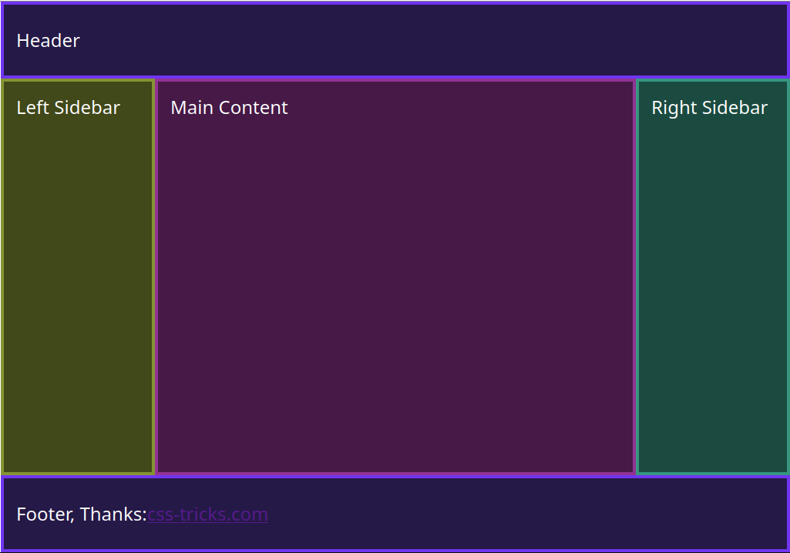

# Layout Header-Main-Left-Right-Footer
Es bildet das 3-Zeilen - 3 Spalten Layout nach als statisches Layout mit fester Breite und Ausrichtung.

Der Unterschied zu contao-layout-3x3 ist, es kommt ohne die zusätzlichen DIV Tags aus (wrapper, container, inside).
Dazu benutzt es grid-area Definitionen und arbeitet mit grid-template-columns, grid-template-rows usw.



Die "layout-grid-areas.css" ist auf GitHub im Verzeichnis contao-css zu finden, wurde mit einigen wenigen Contao Elementen erweitert.

Im Twig sind einige Zeilen auskommentiert. Wer was davon braucht kann das dann aktivieren, einfach `{#` und `#}` entfernen.

**Hinweis:** Nur grob getestet.
```
<html>
<head>

    <style nonce="caoaZySVGzitgueWfpUXBWFQ">
    /* Mobile Styles */
    #wrapper {
        display: grid;
        grid-template-areas:
            "head"
            "left"
            "main"
            "right"
            "foot";
        min-height: 100vh;
    }

    #wrapper > header,
    footer {
        display: flex;
        align-items: center;
    }

    header {
        grid-area: head;
    }

    #left-side {
        grid-area: left;
    }

    main {
        grid-area: main;
    }

    #right-side {
        grid-area: right;
    }

    footer {
        grid-area: foot;
    }

    /* Tablet styles */
    @media screen and (min-width: 500px) {
        #wrapper {
            grid-template-columns: 0.5fr 1fr;
            grid-template-rows: 100px 1fr 1fr 100px;
            grid-template-areas:
            "head head"
            "left main"
            "right main"
            "foot foot";
        }
    }

    /* laptop and desktop styles */
    @media screen and (min-width: 960px) {
        #wrapper {
            grid-template-columns: 200px 1fr 200px;
            grid-template-areas:
                "head head head"
                "left main right"
                "left main right"
                "foot foot foot";
            width: 1024px;
            margin: 0 auto;
        }
    }
    </style>

    <link rel="stylesheet" href="layout-grid-areas.css">
    <link rel="stylesheet" href="your_own.css">

</head>

<body id="wrapper">
        <header id="header">
        </header>

        <main id="main">
        </main>

        <aside id="left-side">
        </aside>

        <aside id="right-side">
        </aside>

        <footer id="footer">
        </footer>
</body>

</html>
```